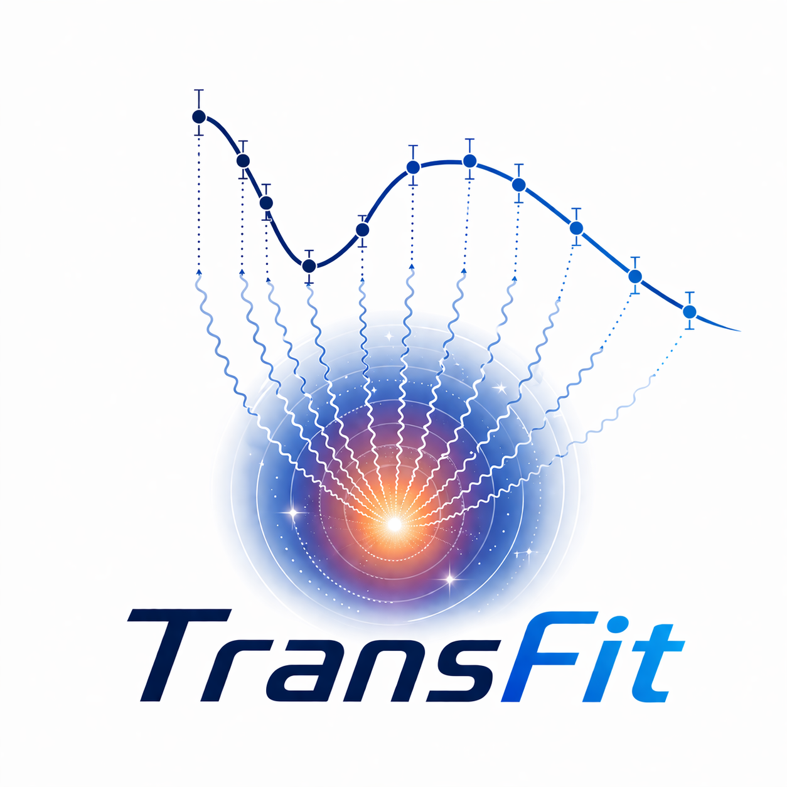
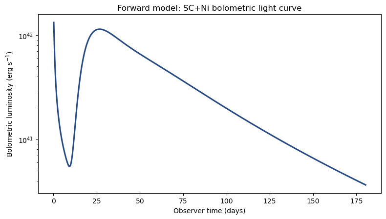
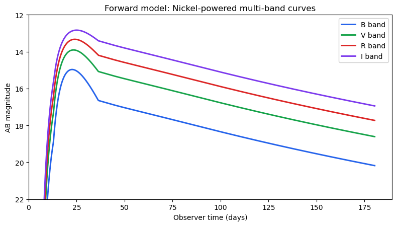

# TransFit 简体中文版

<p align="right">
  <strong>语言：</strong><a href="../README.md">English</a> | 简体中文
</p>

<p align="center">
  
</p>

<p align="center">
  
  
  
  
  
  
</p>

<p align="center">
  <a href="#安装方式">安装</a> |
  <a href="#快速开始">快速开始</a> |
  <a href="#公开-api">公开 API</a> |
  <a href="../examples/tutorial.ipynb">教程 Notebook</a> |
  <a href="../examples/data">示例数据</a> |
  <a href="https://doi.org/10.3847/1538-4357/adfed6">论文</a>
</p>

TransFit 是一个面向超新星等瞬变天体的光变曲线建模与拟合框架。它提供精简的
Python 接口，用于理论光变计算、测光光变拟合和多波段测光拟合，并支持贝叶斯
采样器。

---

## 目录

- [主要功能](#主要功能)
- [安装方式](#安装方式)
- [快速开始](#快速开始)
  - [查看模型参数](#查看模型参数)
  - [正向计算光变曲线](#正向计算光变曲线)
  - [拟合数据](#拟合数据)
- [公开 API](#公开-api)
- [验证](#验证)
- [文档](#文档)
- [联系方式](#联系方式)
- [引用](#引用)

---

## 主要功能

### 物理光变模型

- 支持带扩散过程的瞬变天体测光光变模型。
- 通过统一参数接口支持 nickel、magnetar 和 magnetar-plus-nickel 模型族。

### 多波段测光

- 支持流量空间或星等空间的多波段光变曲线。
- 通过稳定的 band 名称映射滤光片，例如 `B`、`V`、`R` 和 `I`。
- 支持消光和测光系统设置。

### 贝叶斯拟合

- 测光拟合和多波段拟合使用同一个结果对象。
- 默认使用 `emcee` 拟合，并可选支持 `zeus` 和 `dynesty` 后端。
- 主要结果通过 `res.best_params`、`res.best_params_raw`、
  `res.median_params` 和 `res.best_fit` 读取。

---

## 安装方式

默认安装会同时安装默认拟合后端 `emcee`：

```bash
python -m pip install transfit
```

如果从克隆的仓库进行本地开发：

```bash
git clone <your-repo-url>
cd TransFit
python -m pip install -e ".[plot,examples]"
```

如果需要安装全部采样器后端（`emcee`、`zeus` 和 `dynesty`）：

```bash
python -m pip install "transfit[all-samplers]"
```

如果只需要轻量的理论光变计算环境，不想安装 `emcee`，可以手动安装核心数值依赖，
再使用 `--no-deps` 安装 TransFit：

```bash
python -m pip install numpy numba astropy scipy
python -m pip install transfit --no-deps
```

如果是从克隆仓库进行轻量 editable 安装，对应命令是：

```bash
python -m pip install -e . --no-deps
```

这个轻量路径只建议用于 forward light-curve generation。默认的 `fit_bol()` 和
`fit_multiband()` 采样器需要 `emcee`。

---

## 快速开始

<details>
<summary><strong>查看模型参数</strong></summary>

```python
import transfit as tf

tf.model_param_names("nickel")
tf.param_template("nickel")
```

</details>

<details>
<summary><strong>正向计算光变曲线</strong></summary>

测光光变曲线：

```python
import matplotlib.pyplot as plt
import transfit as tf

params_nickel = {
    "M_ej": 3.0,
    "v_ej": 1.0,
    "E_Th_in": 1.5,
    "M_Ni": 0.08,
    "R_0": 120.0,
    "x_Ni": 0.2,
    "kappa": 0.12,
    "kappa_gamma": 0.03,
    "T_floor": 4500.0,
}

bol = tf.lightcurve_bol(
    model="nickel",
    params=params_nickel,
    z=0.001728,
    t_max_days=180.0,
)

fig, ax = plt.subplots()
ax.plot(bol.t_days, bol.Lbol)
ax.set_yscale("log")
ax.set_xlabel("Observer time (days)")
ax.set_ylabel("Bolometric luminosity (erg s$^{-1}$)")
```

<p align="center">
  
</p>

多波段光变曲线：

```python
import matplotlib.pyplot as plt
import transfit as tf

filters = {
    "B": "johnson_cousins.B",
    "V": "johnson_cousins.V",
    "R": "johnson_cousins.R",
    "I": "johnson_cousins.I",
}

params_nickel = {
    "M_ej": 3.0,
    "v_ej": 1.0,
    "E_Th_in": 1.5,
    "M_Ni": 0.08,
    "R_0": 120.0,
    "x_Ni": 0.2,
    "kappa": 0.12,
    "kappa_gamma": 0.03,
    "T_floor": 3000.0,
}

mb = tf.lightcurve_multiband(
    model="nickel",
    params=params_nickel,
    z=0.001728,
    distance_modulus=29.84,
    filters=filters,
    bands=["B", "V", "R", "I"],
    y_kind="mag",
    mag_system="vega",
    extinction={"mw": {"ebv": 0.04, "rv": 3.1, "law": "odonnell94"}},
    t_max_days=180.0,
)

fig, ax = plt.subplots()
for band in mb.bands:
    ax.plot(mb.t_days, mb.y[band], label=band)
ax.invert_yaxis()
ax.set_xlabel("Observer time (days)")
ax.set_ylabel("Vega magnitude")
ax.legend()
```

<p align="center">
  
</p>

</details>

<details>
<summary><strong>拟合数据</strong></summary>

先构造数据容器：

```python
import numpy as np
import transfit as tf

arr = np.loadtxt("examples/data/sn1993j_lbol.txt")
t_days = arr[:, 0] - arr[:, 0].min()

data_bol = tf.BolometricData(
    t_days=t_days,
    y=arr[:, 1],
    yerr=arr[:, 2],
)
```

运行测光拟合：

```python
res_bol = tf.fit_bol(
    data=data_bol,
    model="nickel",
    z=0.001728,
    priors={
        "M_ej": (0.5, 8.0),
        "v_ej": (0.2, 3.0),
        "E_Th_in": (0.05, 8.0),
        "M_Ni": ("log10", -3.0, -0.2),
        "R_0": (10.0, 400.0),
    },
    fixed={
        "x_Ni": 0.2,
        "kappa": 0.12,
        "kappa_gamma": 0.03,
    },
    sampler="emcee",
    sampler_kwargs={
        "nwalkers": 32,
        "nsteps": 600,
        "burnin": 200,
        "thin": 5,
        "seed": 123,
        "progress": True,
    },
)

print(res_bol.best_params_raw)
print(res_bol.best_fit)
```

画图并保存结果：

```python
fig = tf.plot.fit_bol(res_bol, data=data_bol, show_1sigma=True)

path = tf.save(res_bol, path="mcmc_out/fit_nickel_bol_demo.npz")
loaded = tf.load(path)
print(path)
print(loaded["samples"].shape)
```

</details>

---

## 公开 API

主要公开入口是：

```python
tf.BolometricData(t_days, y, yerr, mask=None)
tf.MultiBandData(t_days, band, y, yerr, mask=None)

tf.model_param_names(model)
tf.param_template(model)

tf.lightcurve_bol(model=..., params=..., z=..., t_max_days=...)
tf.lightcurve_multiband(model=..., params=..., z=..., distance_modulus=..., filters=..., bands=...)

tf.fit_bol(data=..., model=..., z=..., priors=..., fixed=...)
tf.fit_multiband(data=..., model=..., z=..., distance_modulus=..., filters=..., priors=..., fixed=...)

tf.save(res, path=None)
tf.load(path, trusted=False)
```

如果需要在指定观测时间点计算模型值，也可以使用高级插值辅助函数：

```python
tf.predict_bol(...)
tf.predict_multiband(...)
```

`fit_bol()` 和 `fit_multiband()` 返回 `FitResult`。主要结果入口是：

```python
res.best_params       # 四舍五入后的最佳参数 dict
res.best_params_raw   # 全精度最佳参数 dict
res.median_params     # 后验中位数参数 dict
res.best_fit          # 包含 params、errors、log_prob、sample 的摘要
res.best_index        # 最佳后验样本的索引
res.best_log_prob     # 最佳 log posterior 值
res.best_sample       # 原始最佳后验样本向量
res.samples           # 展平后的后验样本
res.log_prob          # 每个样本的 log posterior
res.meta              # priors、bounds、sampler 和模型设置元数据
```

## 验证

运行测试：

```bash
python -m pytest -q
```

当前测试覆盖公开 API、拟合流程、多波段测光、消光处理和结果对象访问方式。

---

## 文档

- [教程 Notebook](../examples/tutorial.ipynb)
- [示例数据](../examples/data)
- [多波段测光设计](multiband_photometry_design.md)
- [模型参数参考](model_parameter_reference.tex)
- [物理回归与收敛测试](../examples/physical_regression_and_convergence_tests.ipynb)

---

## 联系方式

如有问题，可通过邮件联系：

- Liangduan Liu ([liuld@ccnu.edu.cn](mailto:liuld@ccnu.edu.cn))
- Yuhao Zhang ([zhangyh2001@foxmail.com](mailto:zhangyh2001@foxmail.com))
- GuangLei Wu ([wuguanglei@mails.ccnu.edu.cn](mailto:wuguanglei@mails.ccnu.edu.cn))

---

## 引用

如果你在科研工作中使用了本软件，请引用：

```bibtex
@ARTICLE{2025ApJ...992...20L,
       author = {{Liu}, Liang-Duan and {Zhang}, Yu-Hao and {Yu}, Yun-Wei and {Du}, Ze-Xin and {Li}, Jing-Yao and {Wu}, Guang-Lei and {Dai}, Zi-Gao},
        title = "{TransFit: An Efficient Framework for Transient Light-curve Fitting with Time-dependent Radiative Diffusion}",
      journal = {\apj},
         year = 2025,
       volume = {992},
       number = {1},
          eid = {20},
        pages = {20},
          doi = {10.3847/1538-4357/adfed6},
archivePrefix = {arXiv},
       eprint = {2505.13825}
}
```

部分代码与教程内容由 Codex 协助生成。
